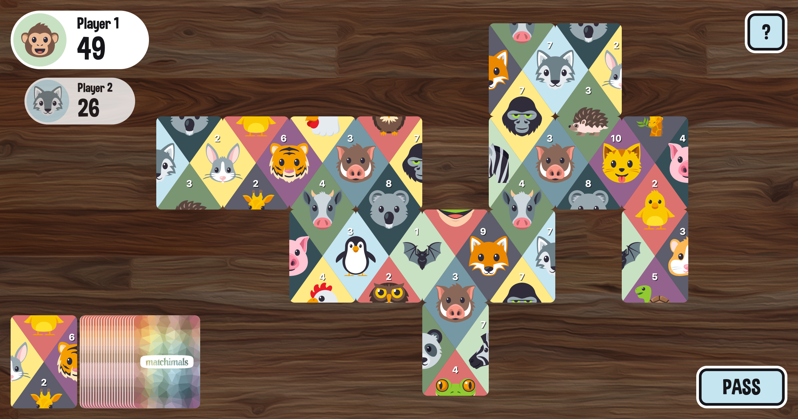

# Matchimals.fun– an animal matching puzzle card game 🦁 🃏

Play online: https://www.matchimals.fun/

## How to play

1. Visit https://www.matchimals.fun/ in your browser
1. The card you draw must be connected to existing cards on the board.
1. If you cannot play, you must pass. Your card will be moved to the bottom of your deck.
1. When any player finishes placing all of their cards, the game ends. The player with the highest score is the winner!

## About

Matchimals was built as a proof-of-concept by Chris Heninger ([@chrisheninger](https://github.com/chrisheninger)) and Hannah Nolan ([@mshannahnv](https://github.com/mshannahnv)). The gameplay is inspired by a 1959 card game called Busy Bee. 🐝 🃏

This project is sponsored by [iGravity Studios](https://igravitystudios.com)– a custom software shop with an emphasis on UI/UX development– based in Phoenix, Arizona. 🏜 ❤️

## Want to contribute?

This game has been made open source to help others looking to learn more about JavaScript, BoardGame.io, and React applications. Find a bug or have a question? Feel free to open an issue or pull request!

### Development (Game logic)

1. Fork the repo
1. Install dependencies (`yarn` or `npm i`)
1. `yarn start`
1. View http://localhost:3000/ in your browser

### Development (Styleguide)

1. Fork the repo
1. Install dependencies (`yarn` or `npm i`)
1. `yarn run styleguide`
1. View http://localhost:6060/ in your browser

## Special thanks

Built with Google's [boardgame.io](https://github.com/google/boardgame.io) library.

Bootstrapped with [Create React App](https://github.com/facebookincubator/create-react-app)

Static hosting by [Netlify](https://www.netlify.com/)
