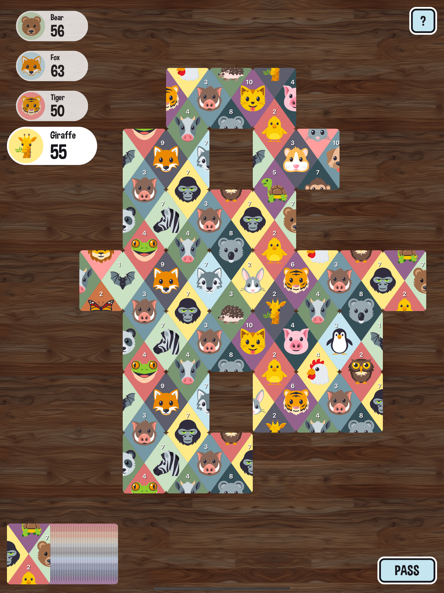

# Matchimals.fun

## an animal matching puzzle card game 🦁 🃏

#### [🍎 Download for iOS from the App Store](https://itunes.apple.com/app/id1348821168)

#### [🤖 Download for Android from the Google Play Store](https://play.google.com/store/apps/details?id=com.matchimals)

#### [🖥 Play on desktop on the web](https://www.matchimals.fun/)

## How to play

1.  1-4 players take turns connecting the top card from the deck to the existing cards on the table.
1.  If there isn't a valid connection to be made, then the player must pass.
1.  The game ends when all the cards from the deck have been connected on the board.

## About

Matchimals.fun was built as a proof-of-concept by Chris Heninger ([@chrisheninger](https://github.com/chrisheninger)) and Hannah Heninger ([@mshannahnv](https://github.com/mshannahnv)). The gameplay is inspired by a 1959 card game called Busy Bee. 🐝 🃏

Matchimals.fun is made for kids of all ages. It aims to provide entertainment and improve pattern recognition skills through fun visuals of animals, colors, and numbers.

This project is sponsored by [iGravity Studios](https://igravitystudios.com)– a custom software shop with an emphasis on UI/UX development– based in Phoenix, Arizona. 🏜 ❤️

## Want to contribute?

This game has been made open source to help others looking to learn more about JavaScript, BoardGame.io, and React-Native applications.

Find a bug or have a question? Feel free to [open an issue](https://github.com/igravitystudios/matchimals.fun/issues) or [submit a pull request](https://github.com/igravitystudios/matchimals.fun/pulls)!

### Development

React-Native development requires a number of tools to be installed and configured on your machine for the bundler and simulators to run properly.

If you have never worked on a native app before- you'll need to follow the directions for setting up a project using the [React-Native CLI Quickstart](https://facebook.github.io/react-native/docs/getting-started.html#installing-dependencies).

Once you've configured your machine for React-Native development- getting the Matchimals.fun app to build should only require a few steps:

1.  Fork the repo
1.  Install dependencies (`yarn` or `npm i`)
1.  Run the metro bundler: `yarn start`
1.  In a separate terminal- run the emulator: `yarn run ios`

## Special thanks

[Nicolo Davis](https://github.com/nicolodavis) and collaborators for the turn-based game engine [boardgame.io](https://github.com/nicolodavis/boardgame.io).

Facebook and collaborators for the wonderful libraries [React](https://reactjs.org/) and [React-Native](https://facebook.github.io/react-native/).

[iGravity Studios](https://igravitystudios.com/) for publishing the game to the Apple App Store and Google Play Store.
